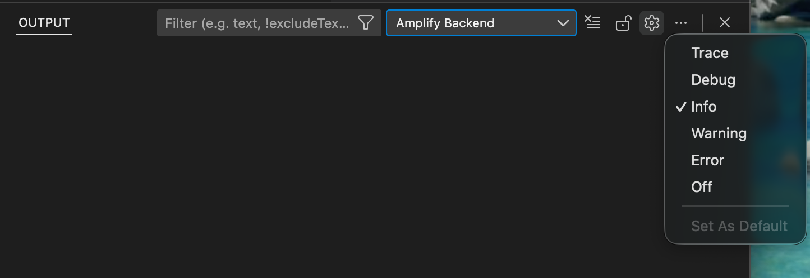

# AWS Amplify Backend VSCode

AWS Amplify Backend VSCode let you following features.

- Explor AWS resources in Amplify Gen2 sandbox environment.
- Switch AWS profile to explor the AWS resources.
- Add/Edit/Remove secrets in sandbox environment.
- monorepo support

## Features

### Resource Explorer

The AWS Backend Explorer gives you a view of the AWS resources in Amplify Sandbox environment that you can work with when using the AWS Backend Explorer.You can open the AWS Resource page of your choice in the AWS Console of your browser.


#### Filter resources

You can filter resources in the AWS Resource Explorer.
You can then switch which filter to use with the filter switching action.
In addition, in `settings.json` you can define custom filters with a pair of names and an array of AWS resources in the tree, as shown below.

```json
{
  "amplifyBackend.explorerFilters": [
    {
      "name": "simple",
      "resources": [
        "AWS::AppSync::GraphQLApi",
        "Custom::AmplifyDynamoDBTable",
        "AWS::Lambda::Function",
        "AWS::S3::Bucket"
      ]
    }
  ]
}
```

#### Switch AWS Profile

You can switch AWS Profile to explor the AWS resources.


### Secret in sandbox environment

You can view/add/edit/remove secrets in your sandbox environment.


See also [Secrets and environment vars in Amplify Docs](https://docs.amplify.aws/react/deploy-and-host/fullstack-branching/secrets-and-vars/#local-environment).

## Logging

This extension outputs logs to help you troubleshoot issues. You can view the logs in the VS Code Output panel:

1. Open the Output panel: `View` > `Output` (or `Cmd+Shift+U` / `Ctrl+Shift+U`)
2. Select `Amplify Backend` from the dropdown menu

The extension logs the following information:

- AWS SDK API calls and errors
- AWS profile changes
- Tree view refresh events
- Amplify project detection process
- CloudFormation stack operations

### Changing Log Level

You can control the log level from the Output panel:

1. Open the Output panel and select `Amplify Backend` from the dropdown
2. Click the gear icon (⚙️) in the Output panel toolbar
3. Choose the desired log level:
   - **Trace**: All logs including trace messages
   - **Debug**: Debug and higher level logs
   - **Info**: Info and higher level logs (default)
   - **Warning**: Warnings and errors only
   - **Error**: Errors only
   - **Off**: No logs



## Release Notes

See [Changelog](./CHANGELOG.md)
