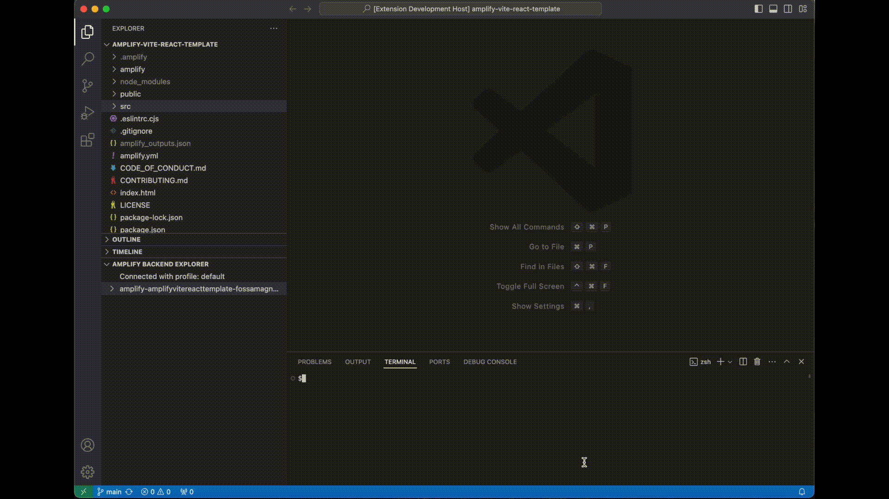
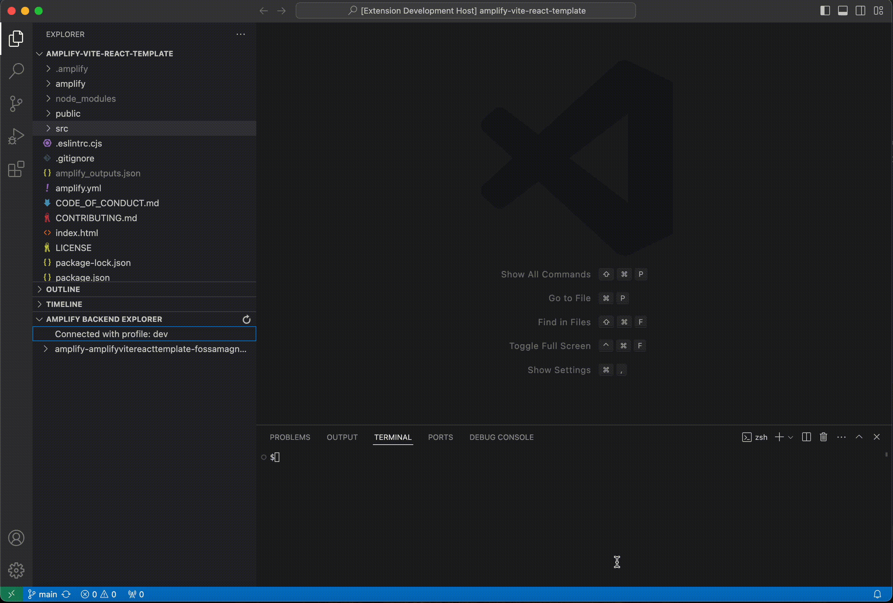
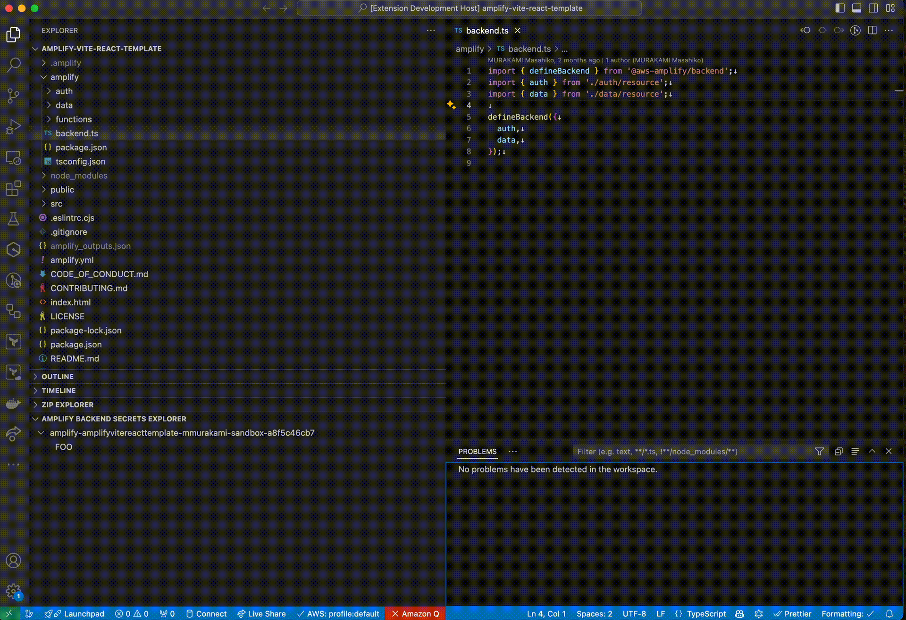

# AWS Amplify Backend VSCode

AWS Amplify Backend VSCode let you following features.

- Explor AWS resources in Amplify Gen2 sandbox environment.
- Switch AWS profile to explor the AWS resources.
- Add/Edit/Remove secrets in sandbox environment.
- monorepo support

## Features

The AWS Backend Explorer gives you a view of the AWS resources in Amplify Sandbox environment that you can work with when using the AWS Backend Explorer.You can open the AWS Resource page of your choice in the AWS Console of your browser.

You can switch AWS Profile to explor the AWS resources.

You can view/add/edit/remove secrets in your sandbox environment.

See also [Secrets and environment vars in Amplify Docs](https://docs.amplify.aws/react/deploy-and-host/fullstack-branching/secrets-and-vars/#local-environment).

## Release Notes

See [Changelog](./CHANGELOG.md)
